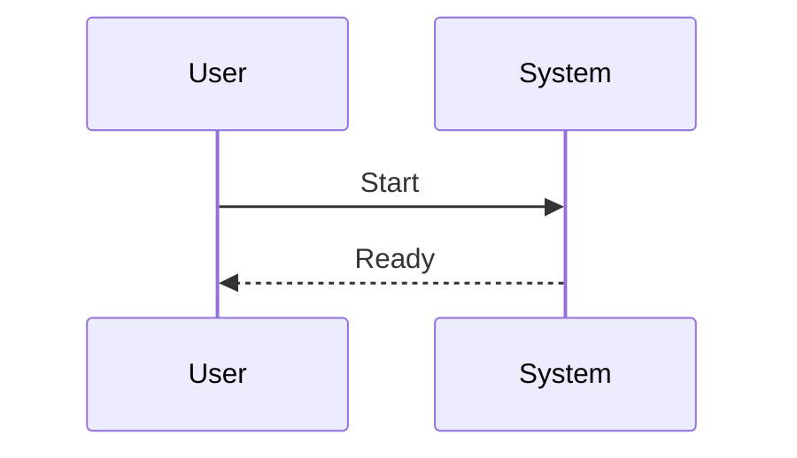

# Application Bootstrap

```text
# Related Code
- `front/src/App.vue`
- `.claude/worktrees/wf_c017c765-e7f-1/front/src/App.vue`
- `.claude/worktrees/wf_c017c765-e7f-1/front/src/main.js`
- `front/src/main.js`
```

## Startup Sequence
**Confidence: candidate (evidence incomplete). Please verify against code.**


## Key Initialization Steps
- [Step]
