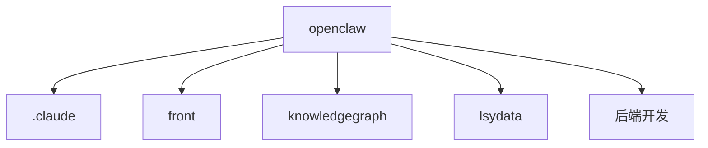
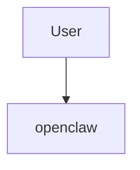

# Architecture Overview

```text
# Related Code
- `path/to/file`
```

## Design Rationale

- [Why this architecture exists]

## Component Diagram

```mermaid
graph TD
core[openclaw]
_claude[.claude]
core --> _claude
front[front]
core --> front
knowledgegraph[knowledgegraph]
core --> knowledgegraph
lsydata[lsydata]
core --> lsydata
____[后端开发]
core --> ____
```

## Data Flow

```mermaid
graph TD
user[User]
system[openclaw]
user --> system
```

## Tech Debt Notes
- [Debt 1]
