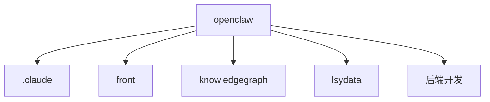

# Core Components Overview

```text
# Related Code
- `path/to/file`
```

## Component Dictionary

- openclaw: [responsibility]
- .claude: [responsibility]
- front: [responsibility]
- knowledgegraph: [responsibility]
- lsydata: [responsibility]
- 后端开发: [responsibility]

## Relationship Graph

