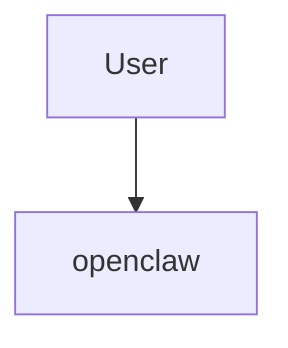

# Overview

```text
# Related Code
- `path/to/file`
```

## One-Line Definition

- openclaw is a [type] system that [primary goal].

## Tech Stack Radar
- JavaScript/TypeScript
- Python

## System Context Diagram


## Architecture Highlights
- [Highlight 1]
- [Highlight 2]
- [Highlight 3]

## Key Risks / Tech Debt
- [Risk 1]
- [Risk 2]
